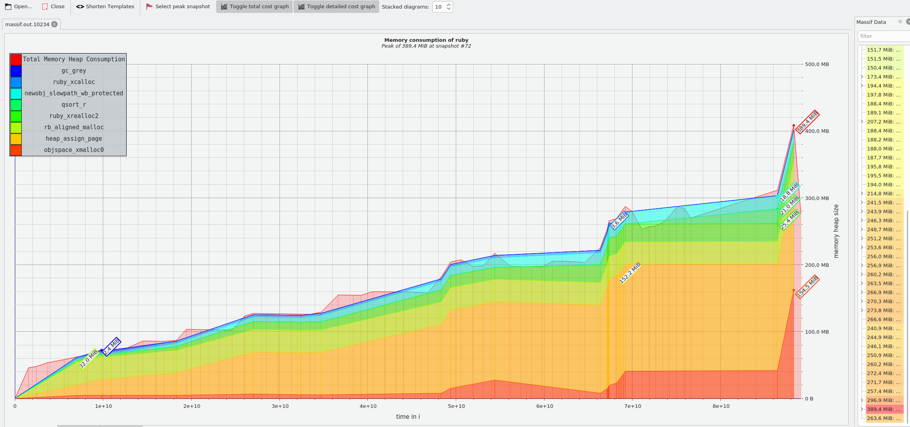
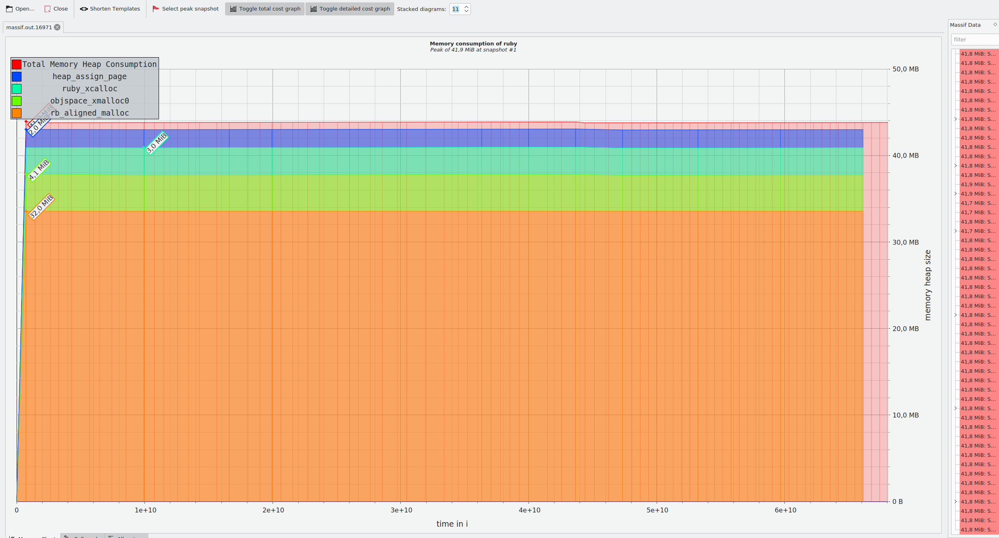

# Case-study оптимизации

## Актуальная проблема
В нашем проекте возникла серьёзная проблема.

Необходимо было обработать файл с данными, чуть больше ста мегабайт.

У нас уже была программа на `ruby`, которая умела делать нужную обработку.

Она успешно работала на файлах размером пару мегабайт, но для большого файла она работала слишком долго, и не было понятно, закончит ли она вообще работу за какое-то разумное время.

Я решил исправить эту проблему, оптимизировав эту программу.

## Формирование метрики
Для того, чтобы понимать, дают ли мои изменения положительный эффект на быстродействие программы я придумал использовать такую метрику: программа не должна потреблять больше 70Мб памяти при обработке файла data_large в течение всей своей работы

## Гарантия корректности работы оптимизированной программы
Программа поставлялась с тестом. Выполнение этого теста в фидбек-лупе позволяет не допустить изменения логики программы при оптимизации.

## Feedback-Loop
Для того, чтобы иметь возможность быстро проверять гипотезы я выстроил эффективный `feedback-loop`, который позволил мне получать обратную связь по эффективности сделанных изменений за 15 - 40 секунд

Вот как я построил `feedback_loop`:

1. Профилирование
2. Изменение кода
3. Тесты
4. Постоение отчета 

## Вникаем в детали системы, чтобы найти главные точки роста
Для того, чтобы найти "точки роста" для оптимизации я воспользовался:

- memory_profiler
- ruby-prof 
- stackprof
### Предварительный анализ


В пике программа потребляет 409мб, что не укладывается в наш бюджет.

### Ваша находка №1

- Парсинг даты

```
data[:dates].map {|d| Date.parse(d)}.sort.reverse.map { |d| d.iso8601 }
```
- Убираем парсинг даты
```
data[:dates].sort.reverse
```
- потребление в пике памяти снизилось до 389мб, но характер роста остался прежним

  
- исправленная проблема перестала быть главной точкой роста(memory profiler)

### Ваша находка №2

- Общий список браузером, на большом объеме вставка в массив, сортировка и получение уникальных элементов
```
allBrowsers = []

allBrowsers << session['browser'] 

allBrowsers = allBrowsers.sort.uniq

oj.push_value(allBrowsers.count, 'uniqueBrowsersCount')
oj.push_value(allBrowsers.join(','), 'allBrowsers')
```
- Заменим Array на SortedSet
```
all_browsers = SortedSet.new

all_browsers.add(session['browser'])

allBrowsers = ''
firstIteration = true
all_browsers.each do |browser|
  if firstIteration
    allBrowsers = browser.dup
  else
    allBrowsers << ','
    allBrowsers << browser.dup
  end
  firstIteration = false
end

oj.push_value(all_browsers.count, 'uniqueBrowsersCount')
oj.push_value(allBrowsers, 'allBrowsers')
 
```
- потребление в пике памяти снизилось до 40мб, исчез роста памяти в зависимости от количества данных   
  

- исправленная проблема перестала быть главной точкой роста и мы уложились в бюдет

## Результаты
Удалось улучшить метрику системы и уложиться в заданный бюджет. Программа теперь не должна потреблять больше 70Мб памяти при обработке файла data_large в течение всей своей работы

## Защита от регрессии производительности
Для защиты от потери достигнутого прогресса при дальнейших изменениях программы были написыны тесты:

```
RSpec.shared_examples 'check speed' do |size, time|
  context "when size == #{size}" do
    let(:size) { size }

    it 'works under 0.5 s' do
      expect { work }.to perform_under(time)
    end
  end
end

context 'check execution speed' do
  it_behaves_like 'check speed', 1500, 0.15
  it_behaves_like 'check speed', 3000, 0.3
  it_behaves_like 'check speed', 6000, 0.6
  it_behaves_like 'check speed', 12000, 0.12
end
```

