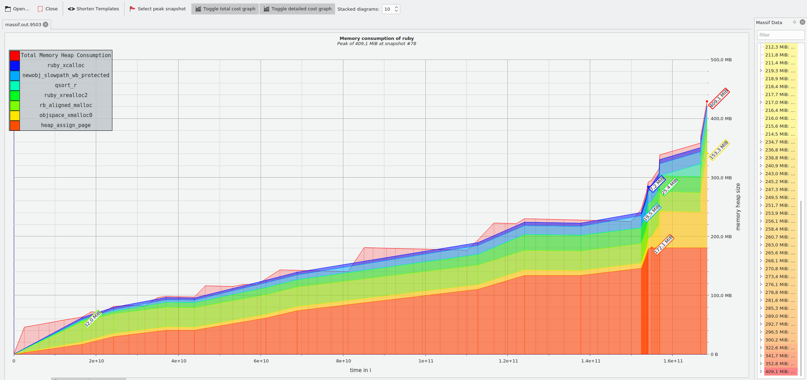

# Case-study оптимизации

## Актуальная проблема
В нашем проекте возникла серьёзная проблема.

Необходимо было обработать файл с данными, чуть больше ста мегабайт.

У нас уже была программа на `ruby`, которая умела делать нужную обработку.

Она успешно работала на файлах размером пару мегабайт, но для большого файла она работала слишком долго, и не было понятно, закончит ли она вообще работу за какое-то разумное время.

Я решил исправить эту проблему, оптимизировав эту программу.

## Формирование метрики
Для того, чтобы понимать, дают ли мои изменения положительный эффект на быстродействие программы я придумал использовать такую метрику: программа не должна потреблять больше 70Мб памяти при обработке файла data_large в течение всей своей работы

## Гарантия корректности работы оптимизированной программы
Программа поставлялась с тестом. Выполнение этого теста в фидбек-лупе позволяет не допустить изменения логики программы при оптимизации.

## Feedback-Loop
Для того, чтобы иметь возможность быстро проверять гипотезы я выстроил эффективный `feedback-loop`, который позволил мне получать обратную связь по эффективности сделанных изменений за 15 - 40 секунд

Вот как я построил `feedback_loop`:

1. Профилирование
2. Изменение кода
3. Тесты
4. Постоение отчета 

## Вникаем в детали системы, чтобы найти главные точки роста
Для того, чтобы найти "точки роста" для оптимизации я воспользовался:

- memory_profiler
- ruby-prof 
- stackprof

### Предварительный анализ


В пике программа потребляет 409мб, что не укладывается в наш бюджет.

### Ваша находка №1

- Парсинг даты
```
data[:dates].map {|d| Date.parse(d)}.sort.reverse.map { |d| d.iso8601 }
```
- Убираем парсинг даты
```
data[:dates].sort.reverse
```
- потребление в пике памяти снизилось до 389мб

  
- исправленная проблема перестала быть главной точкой роста


